## Spring Boot 프로젝트 생성 및 실행 확인

### 목적
- "개발 가능한 최소 상태 만들기"

### 절차
1. Spring Initializer에서 Spring Boot 프로젝트 생성 및 의존성 추가

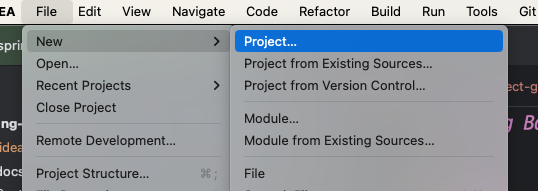
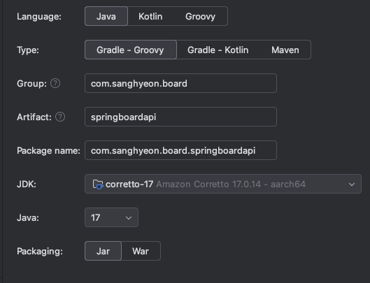

- Java17 : Spring Boot 3.x에서 가장 많이 사용.
- Gradle-Groovy : 의존성 관리 및 빌드 설정이 간단 / 유지보수 간편
- Group : 개인 이름 sanghyeon + 도메인 board
- Artifact : 하이픈 삭제
- Jar : Spring Boot 내장 톰캣 활용.

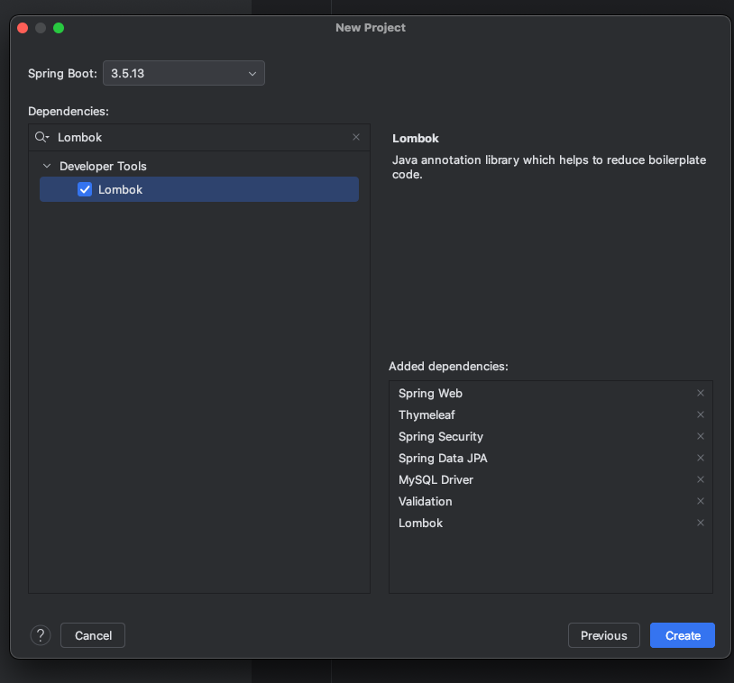

- Spring Web : `웹 요청 처리용`
- Thymeleaf : `화면 구성용 템플릿 엔진`
- Spring Security : `로그인/권한 처리`
- Spring Data JPA : `DB 처리`
- MySQL Driver : `MySQL 연동`
- Validation : `입력값 검증`
- Lombok : `반복 코드 감소`

2. Spring Boot 프로젝트로 인식 및 실행되는지 체크

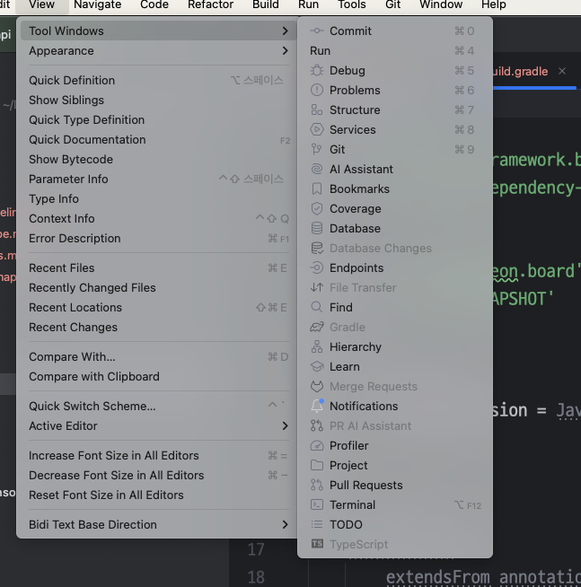
- View -> Tool Windows -> Gradle 비활성화 상태

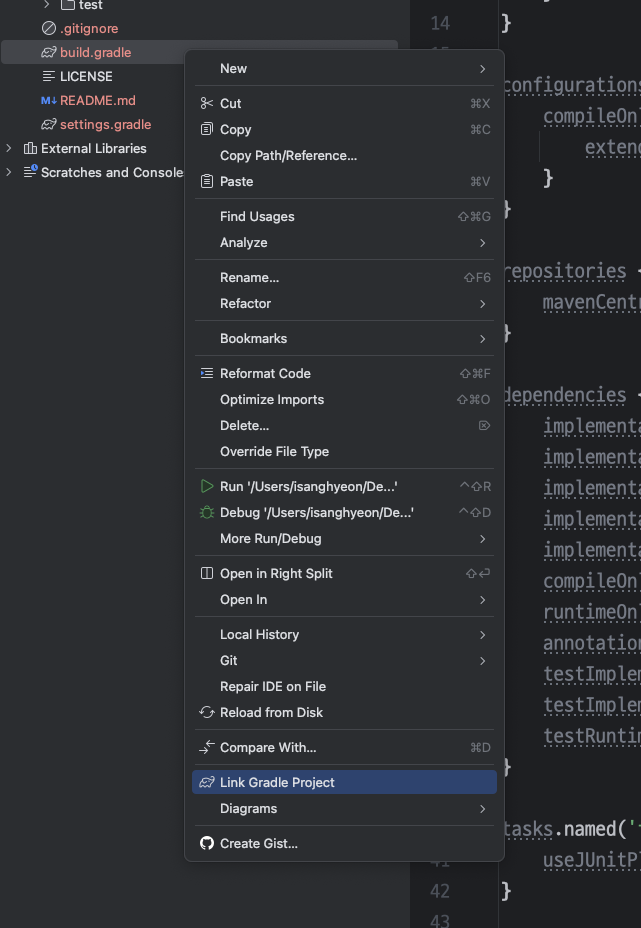
- build.gradle 우클릭 -> Link Gradle Project

3. 스프링 부트 실행 

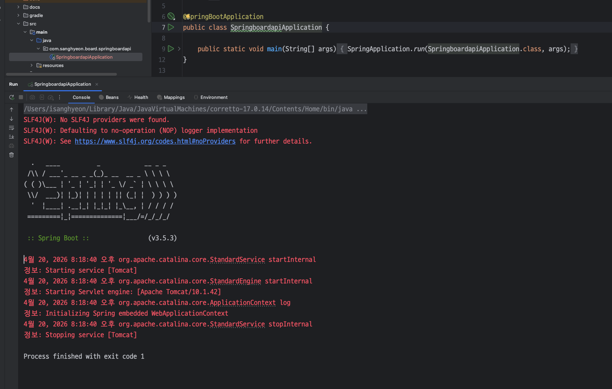
- 부트 실행 실패

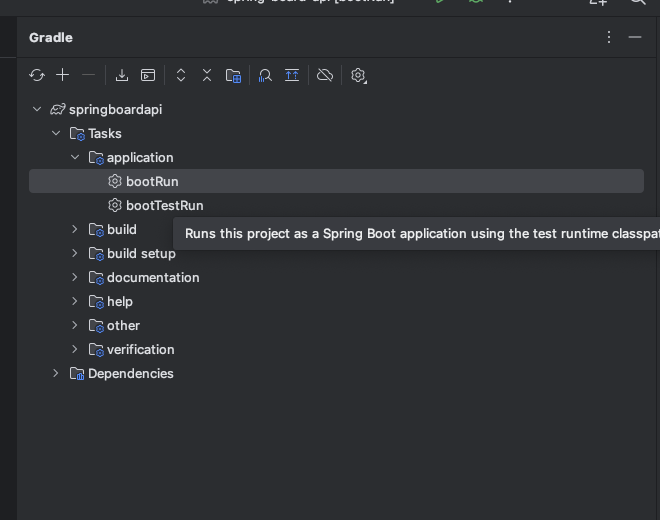
- Gradle -> Tasks -> application -> bootRun 더블클릭

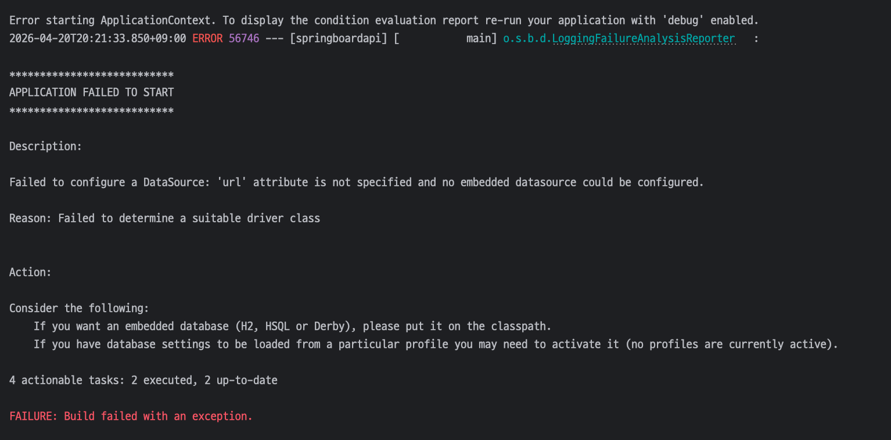
- 오류 메시지 확인 : DataSource url 문제 ( DB 연결정보 없음 )

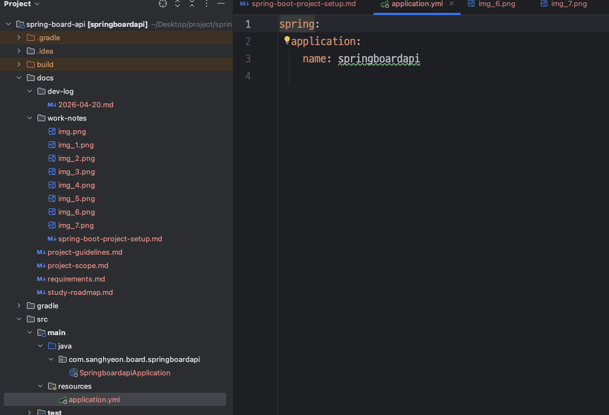
- resources -> application.yml에 추가.
```
  autoconfigure:
    exclude:
      - org.springframework.boot.autoconfigure.jdbc.DataSourceAutoConfiguration
```
- MySQL URL, username, password 미기재 상태에서 JPA로 인해
- Spring Boot가 DB 연결 시도 후 실패해서 발생하는 오류.
- DB 자동 설정 제외.

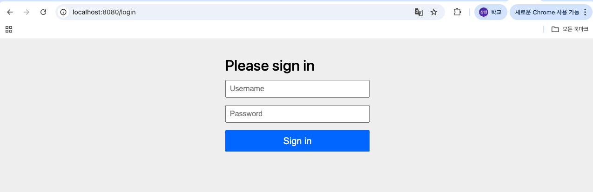
- Spring Security 의존성으로 인해 Spring Boot가 기본 보안 설정을 적용해둠.
- 기본 사용자 이름 : `user`
- 기본 비밀번호 : 서버 실행 시 콘솔에 찍히는 security password

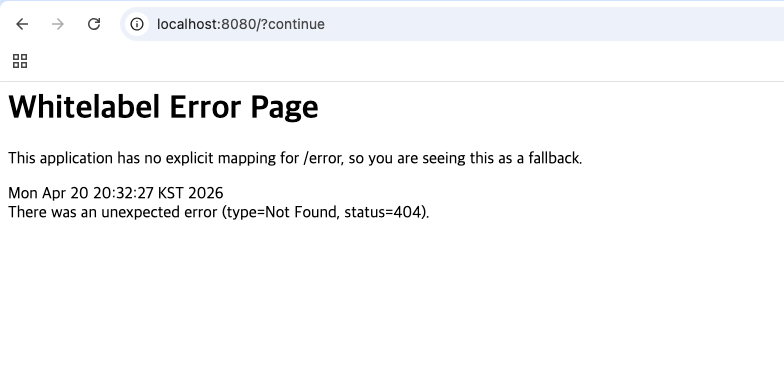
- 정상 접속 확인. 

## 프로젝트 코드 구조

1. build.gradle
- 프로젝트의 빌드 설정 파일
- 의존성, Java 버전, 테스트 방식 등을 설정한다.
- `프로젝트의 기술 스택과 실행 조건을 모아둔 파일이다.`

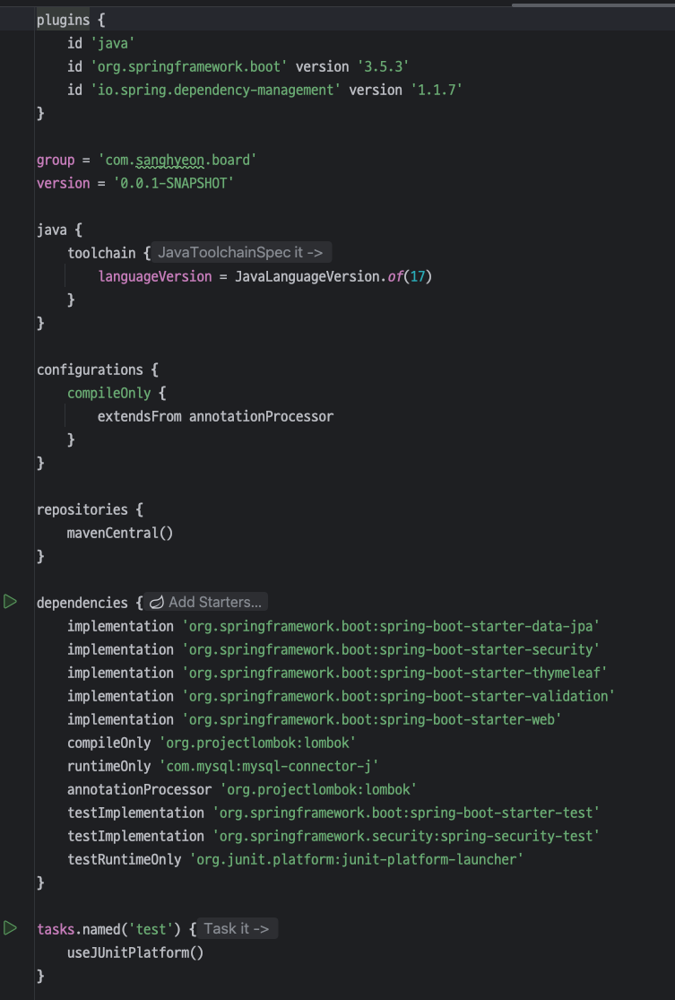

2. settings.gradle
- `프로젝트 이름`과 같은 기본 정보가 들어간다.

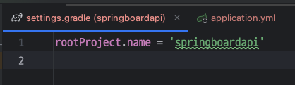

3. src/main/java
- 실제 Java 코드가 들어가는 위치이다.
- `Controller`, `Service`, `Repository`, `Entity`, `DTO` 등...

4. src/main/resources
- 설정 파일, 정적 리소스, 템플릿 등이 들어가는 위치이다.
- `application.yml`, `templates/`, `static/` 등...

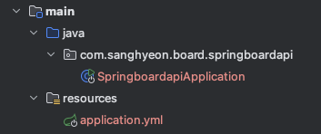

5. src/test/java
- 테스트 코드가 들어가는 위치이다.
- 검증용 코드들이 들어간다.

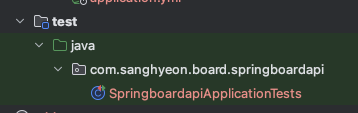