## Spring Boot 기본 인프라 설정

### 목적
- MySQL 연결, JPA 설정, Auditing 적용을 위한 Spring Boot 기본 인프라 구성.

## application.yml이란?
- Spring Boot 애플리케이션의 설정값을 모아두는 파일이다.
- 예를 들어 프로젝트명, DB 연결 정보, JPA 동작 방식 등의 설정을 관리한다.
- Java 코드가 기능을 구현하는 영역이라면 `application.yml`은 실행 환경 및 설정값을 관리하는 영역이라고 볼 수 있다.

### application.yml을 먼저 정리하는 이유
- DB 연결 정보와 JPA 관련 설정은 `application.yml`에서 관리되므로, 기능 구현에 앞서 기본 설정 구조를 먼저 정리한다.
- 애플리케이션 실행 환경을 먼저 정리해두면, 이후 MySQL 연결과 JPA 설정을 더 안정적으로 진행할 수 있다.

### application.yml과 application.properties의 차이
- 둘 다 `Spring Boot`의 `설정 파일`이다.
- `application.properties`는 `key=value` 형식으로 한 줄씩 작성하는 방식으로 작성합니다.
- `application.yml`은 들여쓰리고 계층 구조를 표현하는 방식으로 작성합니다.

### yml을 프로젝트에서 사용하는 이유
- 설정 항목이 많아질수록 `application.yml`은 관련 설정을 묶어서 볼 수 있어 가독성이 좋습니다.

```yaml
spring:
  application:
    name: springboardapi
  datasource:
    url: jdbc:mysql://localhost:3306/spring_board
    username: root
    password: 1234
```

```properties
spring.application.name=springboardapi
spring.datasource.url=jdbc:mysql://localhost:3306/spring_board
spring.datasource.username=root
spring.datasource.password=1234
```

### application.yml에서 정리할 설정 항목
- `application` : 어플리케이션 이름과 같은 기본 정보를 설정한다.
- `datasource` : MySQL과 연결하기 위한 URL, 사용자명, 비밀번호 등 정보를 설정한다.
- `jpa` : JPA가 테이블을 어떻게 다룰지, SQL 로그를 출력할지 등의 동작 방식을 설정한다.
- `logging` : 실행 과정에서 필요한 로그를 어떤 수준으로 확인할 지 설정한다.

### datasource란?
- `datasource`는 Spring Boot 애플리케이션이 데이터베이스에 연결하기 위해 필요한 접속 정보를 관리하는 설정이다.
- 애플리케이션은 `datasource` 설정을 기준으로 어떤 DB에 접속할 지 판단한다.

### datasource 설정이 필요한 이유
- 애플리케이션이 데이터베이스에 접근하여 데이터를 저장하고 조회하려면, 먼저 DB와 연결될 수 있어야 한다.
- 이 때 데이터베이스 주소, 사용자명, 비밀번호와 같은 접속 정보가 필요하며, 이러한 정보를 `applicaiton.yml`의 `datasource` 설정에서 관리한다.

### datasource 주요 설정 항목
- `url` : 어떤 데이터베이스에 접속할지 나타내는 주소이다.
- `username` : 데이터베이스에 접속할 때 사용할 계정명이다.
- `password` : 데이터베이스에 접속할 때 사용할 비밀번호이다.
- `driver-class-name` : 애플리케이션이 어떤 DB 드라이버를 통해 연결할지 지정한다.

## MySQL 연결

### MySQL 연결이 필요한 이유
- 애플리케이션에서 생성된 데이터를 지속적으로 저장하고 조회하기 위해서는 데이터베이스 연결이 필요하다.
- 관계형 데이터베이스인 MySQL을 사용해서 데이터를 저장하고 관리한다.

### MySQL 연결에 필요한 정보
- 데이터베이스 이름 : 어떤 DB에 접속할지
- 사용자 계정, 비밀번호 : DB 로그인 정보 
- 호스트 주소 : DB가 어디에서 실행중인지 
- 포트 번호 : 어떤 통신 포트로 접속할지

### datasource와 MySQL 연결의 관계
- Spring Boot 애플리케이션은 `datasource`에 작성된 URL, 사용자명, 비밀번호 등 정보를 통해 MySQL 데이터베이스에 접속한다.
- 즉, MySQL 연결은 실제 데이터베이스를 준비하는 과정이고, `datasource` 설정은 그 연결 정보를 Spring Boot에 전달하는 것이다.

### 로컬 환경에서 사용할 MySQL 정보
- 로컬 환경에서 MySQL 연결을 위해서는 호스트 주소, 포트 번호, 데이터베이스 이름, 사용자 계정, 비밀번호가 필요하다.
- 로컬에서는 일반적으로 `localhost`, `3306` 포트를 기본값으로 쓴다.

### 연결에 사용할 계정
- 초기 개발 단계에서는 `root` 계정으로 먼저 연결을 확인한다.
- 이후, 필요시 프로젝트 전용 계정을 따로 분리한다.

### `application.yml`에 MySQL 접속 정보 반영
- MySQL에 생성한 데이터베이스와 접속 계정 정보를 기준으로, `application,.yml`의 `datasource` 항목에 접속 정보를 반영한다.
- `url`, `username`, `password`, `driver-class-name` 값을 설정해서 Spring Boot 애플리케이션이 MySQL에 연결될 수 있도록 구성한다.

### DB 접속 정보 보안 관리
- 데이터베이스 비밀번호와 같은 민감 정보는 `application.yml`에 직접 작성하지 않고, 환경변수를 통해 주입하는 방식으로 관리한다.
- `application.yml`에는 실제 값 대신 변수명을 두고, 로컬 실행 환경에서 실제 접속 정보를 별도로 설정하는 방향으로 구성한다.
- 이는 협업 및 배포 환경에서도 확장하기 쉬운 방식이며, 민감 정보가 Git 저장소에 노출되는 걸 줄이는 데 도움이 된다.

```yaml
spring:
  datasource:
    url: jdbc:mysql://[호스트주소]:[포트번호]/[데이터베이스이름]
    username: [사용자계정]
    password: [MySQL 비밀번호]
    driver-class-name: com.mysql.cj.jdbc.Driver
```

```yaml
spring:
  datasource:
    url: ${DB_URL}
    username: ${DB_USERNAME}
    password: ${DB_PASSWORD}
    driver-class-name: com.mysql.cj.jdbc.Driver
```
- 보안을 고려하면 실제 접속 정보를 직접 작성하는 방식보다, 환경변수를 사용하는 두 번째 방식이 더 권장된다.

### 환경변수란?
- 환경변수는 프로그램 실행에 필요한 값을 운영체제에 따로 저장해두고 사용하는 방식이다.
- 애플리케이션은 실행 시 환경변수에 저장된 값을 읽어 설정 정보로 활용할 수 있다.

### 환경변수를 사용하는 이유
- 민감한 정보를 코드나 설정 파일에 직접 작성하지 않고 분리해서 관리할 수 있다.
- 환경에 따라 다른 설정값을 적용하기 쉬워 보안과 유지보수 측면에서 유리하다.

### 로컬 환경변수 설정
```bash
# ~/.zshrc 열기
open ~/.zshrc 

# zshrc 파일 맨 아래에 추가한다. ( 터미널 X )
export DB_URL=[내DB주소]
export DB_USERNAME=[사용자명]
export DB_PASSWORD=[비밀번호]

# 파일을 저장한 뒤 터미널에서 실행해야 적용이 된다.
source ~/.zshrc

# 터미널에서 입력해서 값이 출력되면 잘 적용이 된 것.
echo $DB_URL
echo $DB_USERNAME
echo $DB_PASSWORD
```

### Spring Boot에서 MySQL 연결 테스트
- `application.yml` 설정을 반영한 뒤, Spring Boot 애플리케이션을 실행해서 MySQL 연결이 정상적으로 이루어졌는지 확인한다.
- 실행 과정에서 DataSource 관련 오류 없이 애플리케이션이 정상 가동되면, 기본적인 DB 설정이 완료된 것이다.

### MySQL 실제 연결하기
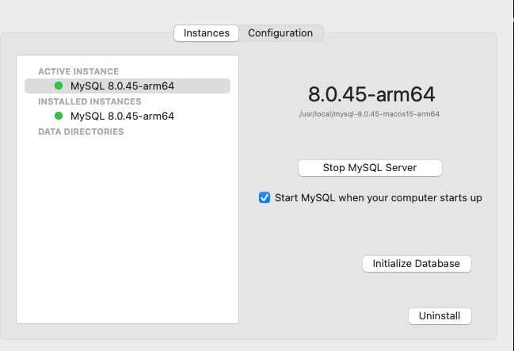
- MySQL 서버를 켠다.

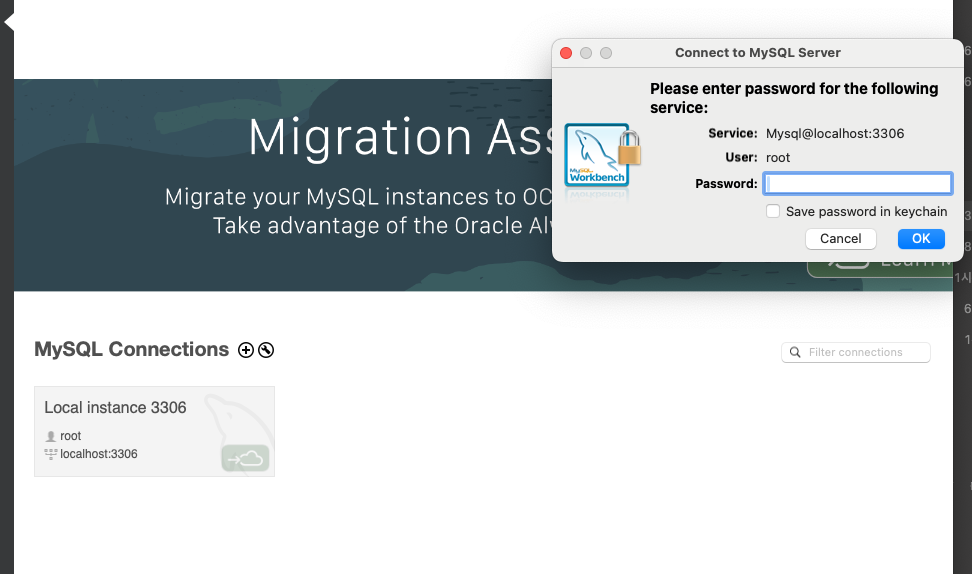
- MySQL에 접속한다.

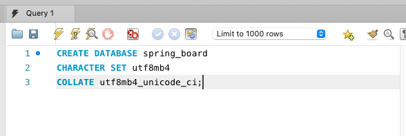
- 프로젝트용 DB를 생성한다.

```sql
CREATE DATABASE spring_board
CHARACTER SET utf8mb4
COLLATE utf8mb4_unicode_ci;
```
- `CREATE DATABASE` : 새로운 데이터베이스를 생성하는 명령어
- `CHARACTER SET` : 문자를 어떤 방식으로 저장할지 정하는 설정
- `COLLATE` : 문자열을 어떤 기준으로 비교하고 정렬할지 정하는 설정
- `spring_board` : 데이터베이스 이름
- `utf8mb4` : 한글, 특수문자, 확장 문자 대응을 위한 문자 저장 규칙 ( MySQL에서 권장됨 )
- `utf8mb4_unicode_ci` : 문자열 비교 규칙 설정 

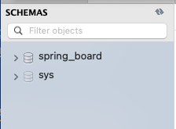
- `SCHEMAS`에서 새로 고침시 보이면 데이터베이스 생성 완료.

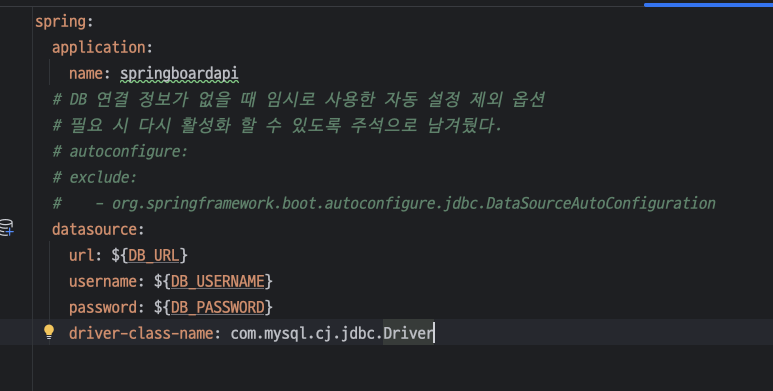
- application.yml에 MySQL 접속 정보 반영 완료. 

- 로컬 환경변수 설정. 
```bash
# ~/.zshrc 열기
open ~/.zshrc 

# zshrc 파일 맨 아래에 추가한다. ( 터미널 X )
export DB_URL=[내DB주소]
export DB_USERNAME=[사용자명]
export DB_PASSWORD=[비밀번호]

# 파일을 저장한 뒤 터미널에서 실행해야 적용이 된다.
source ~/.zshrc

# 터미널에서 입력해서 값이 출력되면 잘 적용이 된 것.
echo $DB_URL
echo $DB_USERNAME
echo $DB_PASSWORD
```

- 연결 테스트
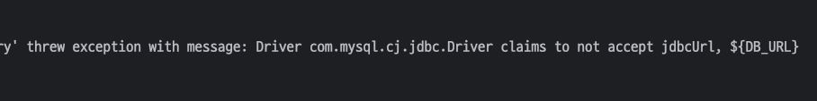

- 오류 발생 : 스프링이 ${DB_URL}을 찾지 못하고, DB_URL을 그대로 읽음. ( 환경 변수 인식 X )
- 원인 : 환경변수를 등록해도 IntelliJ에서 실행 버튼을 눌렀을 때 터미널 세션과 별개일 수 있다.

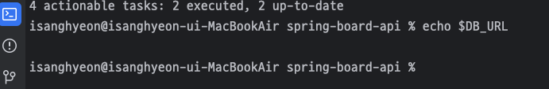
- 터미널에서 환경변수를 읽어오지 못하고 있었다.

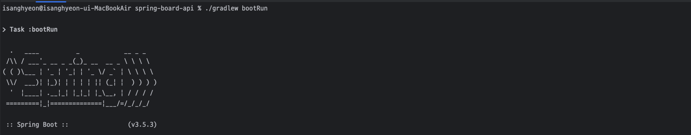
- 터미널에선 정상 실행 되고, IntelliJ Run으로는 실패하는 현상을 확인했다.

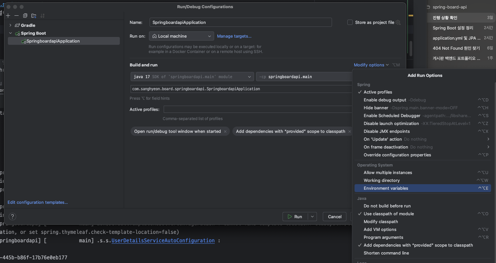
- 인텔리제이 설정에서 Environment variables를 직접 추가한다.

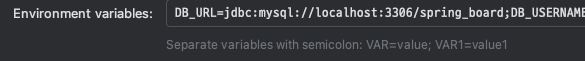
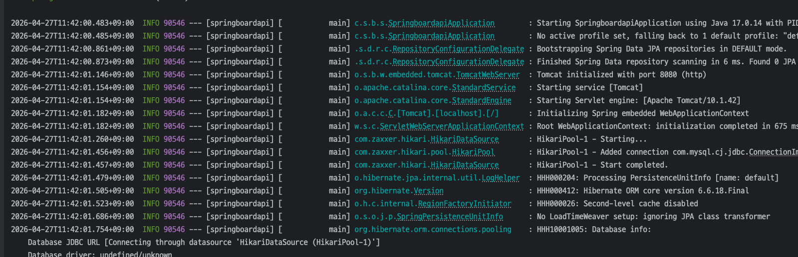
- 환경 변수 추가 후 정상 작동되었다.


